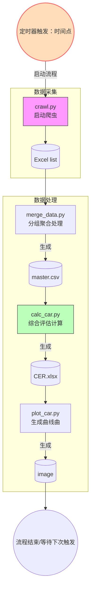
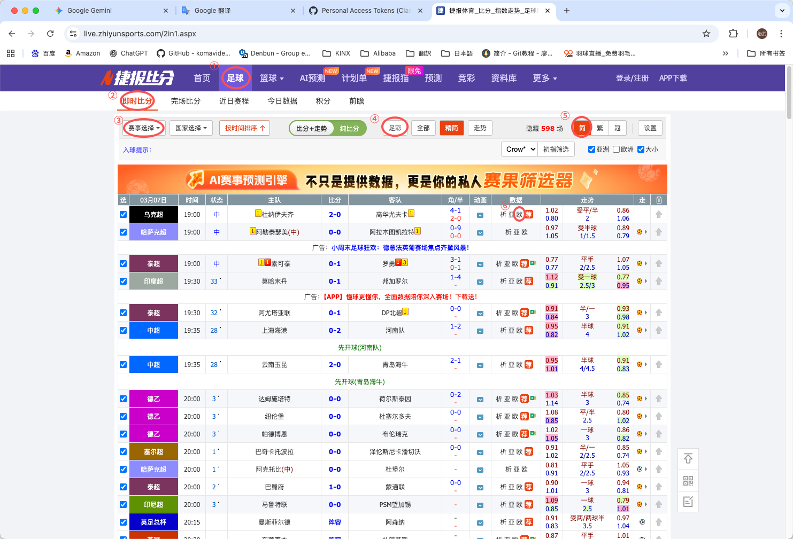
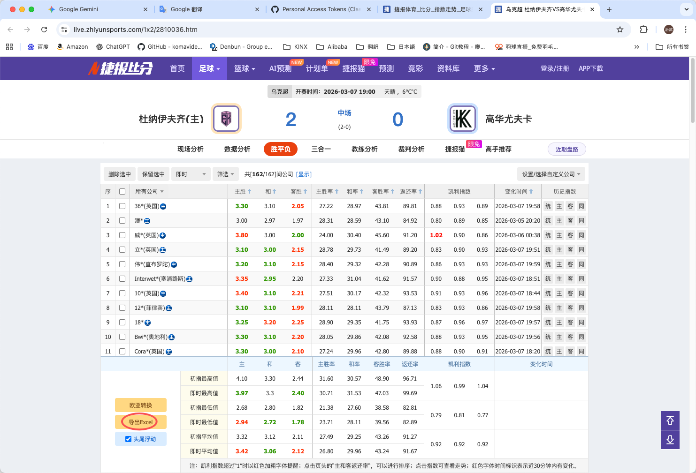
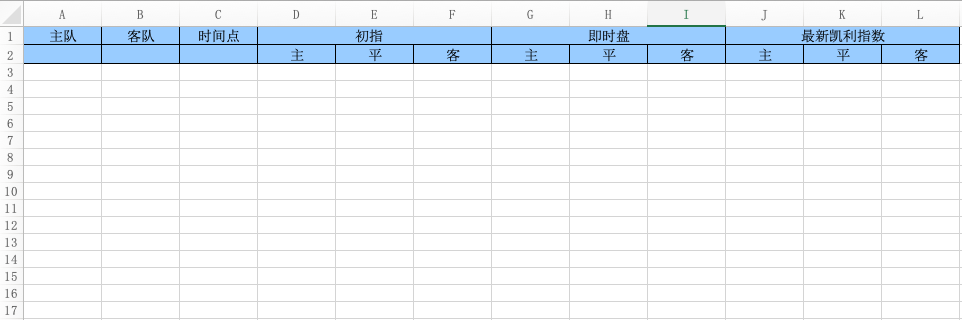
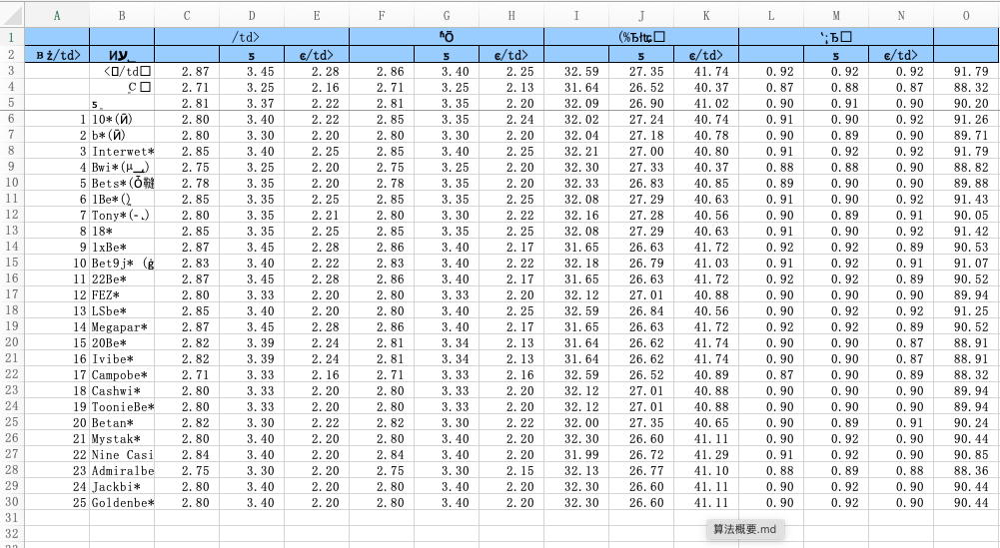
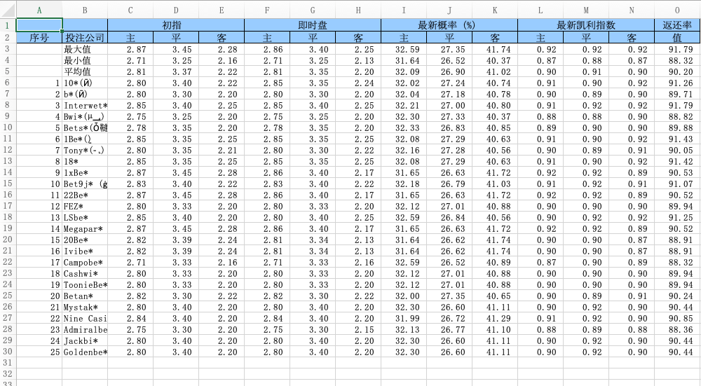
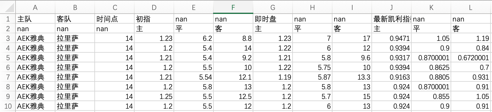
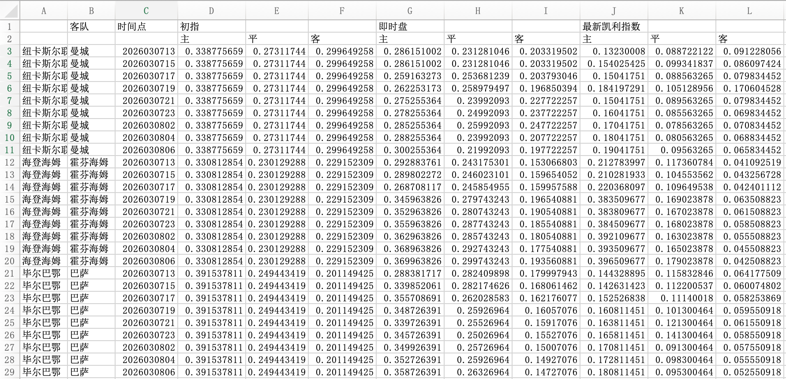

# 设计书

## 1. 执行流程

### 1.1 定时器

本日数据采集时间点包括：

- [当日时间点]：13、15、17、19、21、23；
- [次日时间点]：2、4、6；
- 一天采集点包括：[当日时间点] + [次日时间点]

### 1.2 执行流程

## 2. 数据采集中心

根据以下操作，利用网络爬虫进行下载数据：

### 2.1 第一步

打开网页：https://live.zhiyunsports.com/2in1.aspx

注意：

- ③选择一级赛事
- ④选择北单

### 2.2 第二步

### 2.3 第三步

- 下载的文件目录分为两级目录：
  + 主目录：{CRAWLER_DOWNLOAD_DIR}，由配置文件设置
  + 子目录：{YYYYMMDD}，当日日期

- 下载文件存放规则：

  + 配置文件中设置跨天时间临界点，比如设置为12时

  + **[当日]临界点（12时）后（包含临界点）**下载的文件放在**当日的{YYYYMMDD}**文件夹内
  + **[次日]临界点（12时）前（不包含临界点）**下载的文件也放在**前一天的{YYYYMMDD}**文件夹内
    例如：2026年03月07日11时下载的文件《阿安姆巴格 VS 法基拉普尔年轻人2026030711.xls》放在子目录20260306；
               2026年03月07日12时下载的文件《阿安姆巴格 VS 法基拉普尔年轻人2026030712.xls》放在子目录20260307；
               2026年03月07日13时下载的文件《阿安姆巴格 VS 法基拉普尔年轻人2026030713.xls》放在子目录20260307；

## 3. 数据处理

### 3.1 分组聚合处理

写一个批处理，用来实现对指定的下载文件的文件进行数据合并，合并到一个一览文件，

执行批处理时，需要指定一个由临界点计算出来的日期参数，

例如：

目录：/Users/zhiwuzou/Documents/足球彩票/北单/20260306

这个目录是2026年03月06日下载的数据文件，这些文件每场比赛有根据不同时间点有相应的文件，例如：对于阿安姆巴格 VS 法基拉普尔年轻人这场比赛有12点，15点，17点的文件，文件名分别是：

阿安姆巴格 VS 法基拉普尔年轻人2026030612.xls

阿安姆巴格 VS 法基拉普尔年轻人2026030615.xls

阿安姆巴格 VS 法基拉普尔年轻人2026030617.xls

这个批处理的目的就是把所有比赛的数据有序地合并到一个文件。

执行步骤是：

- 首先指定数据文件目录，对该目录下的数据文件以文件名进行排序
- 根据工程目录下模板文件《template.xlsx》创建一览文件，一览文件文件名以数据文件夹作为名称，例如数据文件目录为：/Users/zhiwuzou/Documents/足球彩票/北单/20260306，那么一览文件名为：20260306.csv，模板结构如下图：

- 指定目录下的数据文件例如《阿安姆巴格 VS 法基拉普尔年轻人2026030612.xls》，其结构如下图：

因为乱码的，为了方便说明，我把乱码的字段名重新编辑了，如下图：

- 然后分别读取每个数据文件，将所有数据写入一览文件20260306.csv
- 数据文件合并到一览文件规则如下
  + 解析数据文件的文件名，文件名结构如下：{主队}{space}VS{space}{客队}{YYYYMMDDHH}.xls
    例如《阿安姆巴格 VS 法基拉普尔年轻人2026030612.xls》解析后
    - 主队：阿安姆巴格
    - 客队：法基拉普尔年轻人
    - 日期：2026年03月06日
    - 时间点：2026030612
  + 把解析出来的主队、客队、时间点分别写入一览文件的A、B、C列
  + 从数据文件的第6行开始读取数据
  + 将数据文件的C、D、E、F、G、H、L、M、N列分别写入一览文件的D、E、F、G、H、I、J、K、L列

### 3.2 综合评估计算

一览文件生成后，其数据结构如图：

每条记录就是某个机构（因为统计是不关心机构，所以机构名没有插入到一览表中）某个时间点（14点）对这场比赛（AEK拉纳卡 VS 阿克里塔斯）的评估。现在要在各个机构的评估值的基础上，再一次进行计算得出一个综合评估值。

- 主队 VS 客队：即一场比赛，注意【AEK拉纳卡 VS 阿克里塔斯】和【阿克里塔斯 VS AEK拉纳卡】被视为两场比赛。
- 每场比赛可能有多个时间点，例如：2026030612、2026030615、2026030617。
- 以一场比赛、时间点进行分组，分别对D、E、F、G、H、I、J、K、L列进行计算，得出D、E、F、G、H、I、J、K、L列的综合评估值。计算公式如下：
  - D列：(MAX(D列)-MIN(D列))/AVERAGE(D列)
  - E列：(MAX(E列)-MIN(E列))/AVERAGE(E列)
  - F列：(MAX(F列)-MIN(F列))/AVERAGE(F列)
  - H列：(MAX(H列)-MIN(H列))/AVERAGE(H列)
  - I列：(MAX(I列)-MIN(I列))/AVERAGE(I列)
  - J列：VARP(J列)*100
  - K列：VARP(K列)*100
  - L列：VARP(L列)*100
- 以template.xlsx文件为模板，创建一个CAR.xlsx文件，把上面的主队、客队、时间点以及计算出来的D～L列的值插入到CAR.xlsx文件。

### 3.3 生成曲线图

根据综合评估表，生成欧赔指数曲线图和凯利指数曲线图。

综合评估表如图所示：

- 图中显示三场比赛的综合评估数据，三场比赛分别是第A列和B列：纽卡斯尔联 VS 曼城、海登海姆 VS 霍芬海姆、毕尔巴鄂 VS 巴萨
- 每场比赛有9个时间点，第C列：2026030713、2026030715、2026030717、2026030719、2026030721、2026030723、2026030802、2026030804、2026030806
- 第D列～第L列就是综合评估数据

#### 3.3.1 欧赔指数

- 欧赔指数曲线图有主、平、客三条曲线。x轴表示时间轴（数据源是第C列），y轴表示初指评估值的主（第D列）、平（第E列）、客（第F列）和即时盘的主（第G列）、平（第H列）、客（第I列）。
- 图中可以看到每场比赛的第D列、第E列、第F列的数值都相同。这三列数据分别作为三条曲线的第一个节点
- 每场比赛的第G列、第H列、第I列的每个数据作为曲线的其他节点，这张数据表提供了10个节点，第1个节点数据来源于初指，其他9个节点数据来源于即时盘

#### 3.3.2 凯利指数

- 凯利指数曲线图有主、平、客三条曲线。x轴表示时间轴（数据源是第C列），y轴表示最新凯利指数的主（第J列）、平（第K列）、客（第L列）
- 凯利指数曲线图的所有数据来源于最新凯利指数

